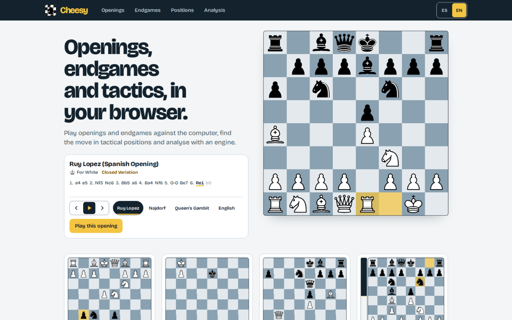
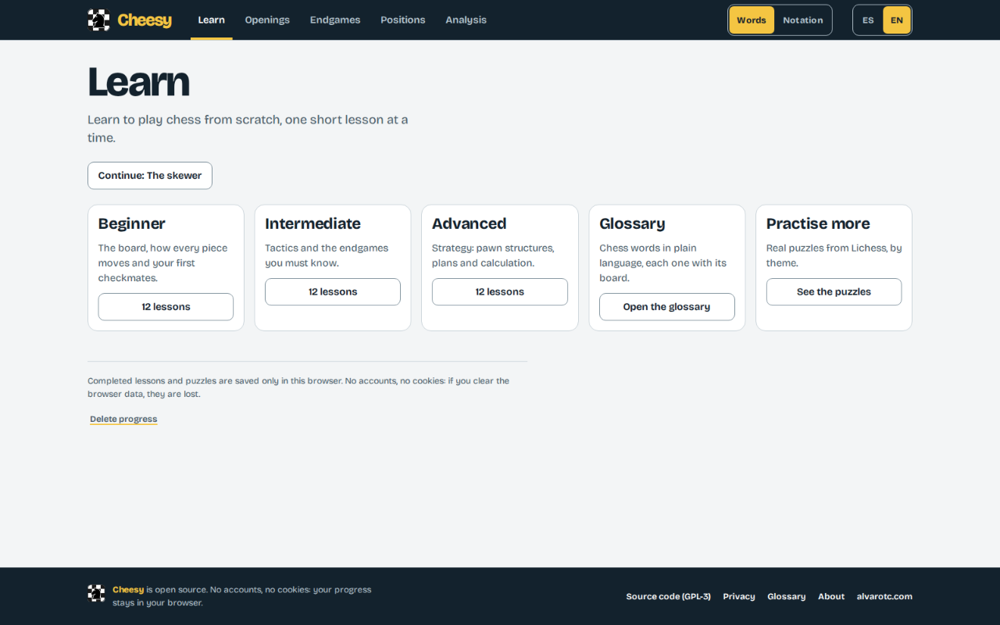
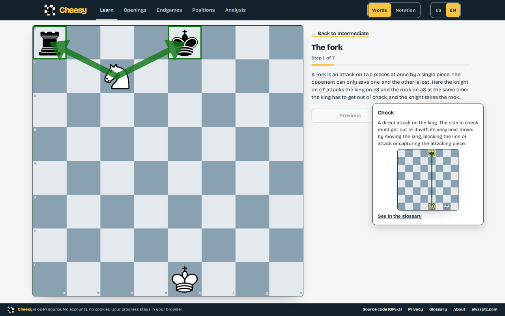
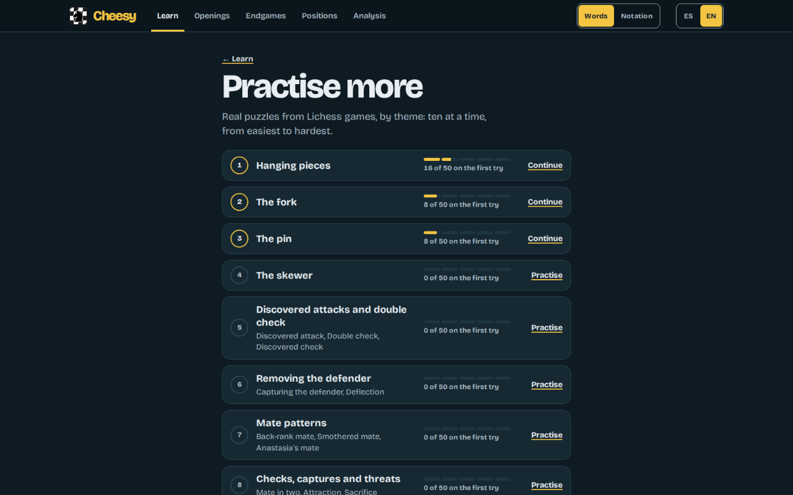
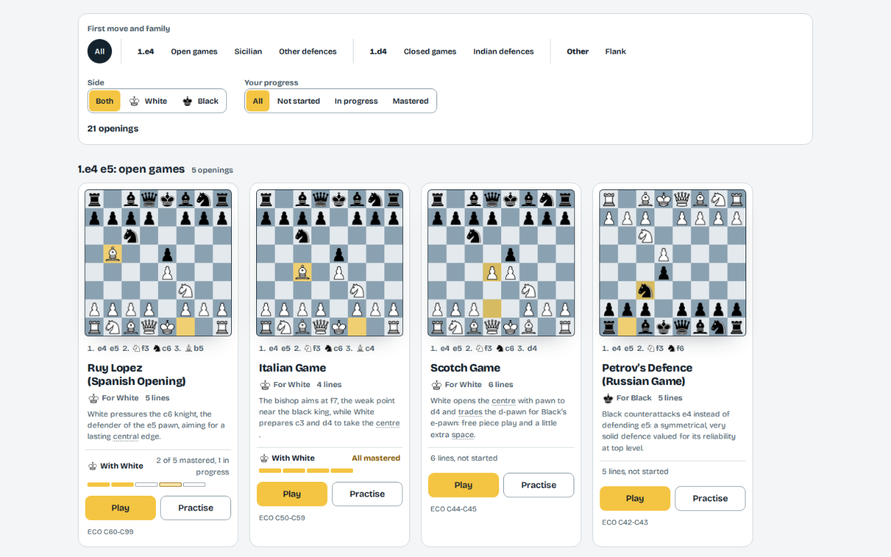
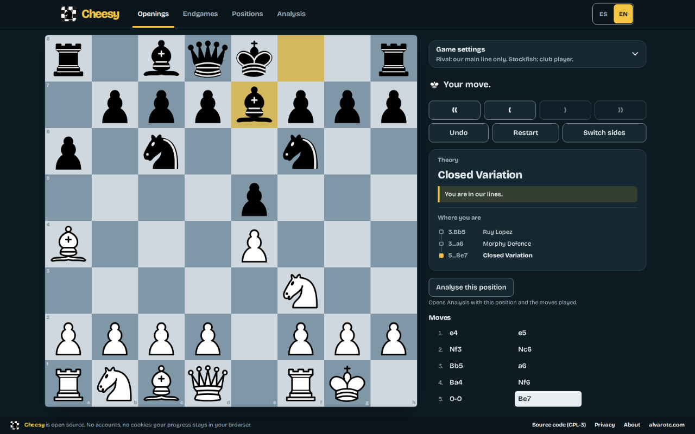
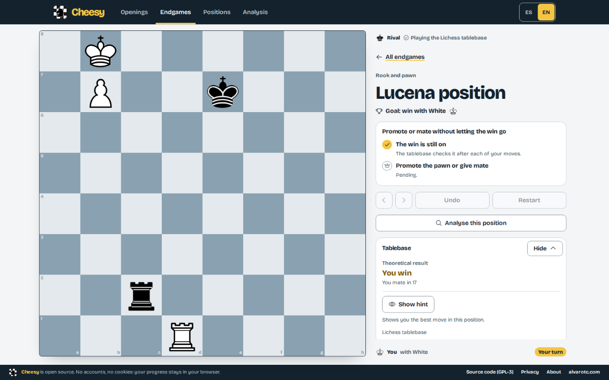
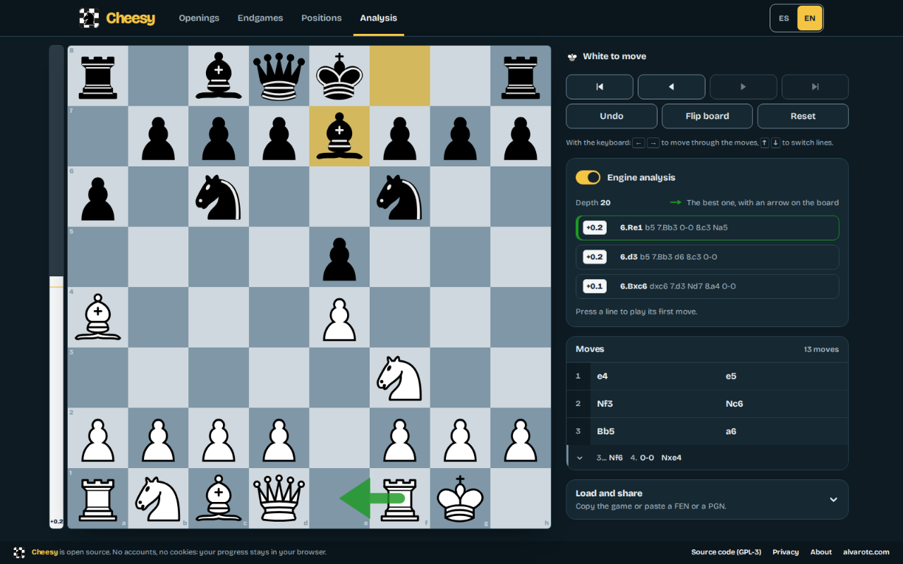

_[Español](README.md) · **English**_

# Cheesy

**Openings, endgames and tactics, in your browser.** Learn to play from scratch
with short lessons, play openings and endgames against the computer, find the
move in tactical positions and analyse with an engine. All in plain language:
moves read as words (“knight to f3”) and, if you prefer, in notation. It is for
anyone who wants to learn and practise chess at their own pace: there is
no sign-up, nothing to install and no ads, and your progress stays on your
device unless you choose to sync it with a code.

[](https://cheesy.alvarotc.com)


[](https://github.com/alvarotorresc/cheesy/actions/workflows/ci.yml)



## What you can do

- **Learn chess from scratch, by level.** Beginner, intermediate and advanced:
  from how each piece moves to tactics, the endgames you must know and strategy.
  Each lesson goes step by step with a board and plain-language text, and mixes
  explanations with exercises: find the move, pick between options or play the
  position out. Chess words open in a bubble with their definition, and the
  glossary gathers them all by family, each with its example board. The lessons
  you complete are remembered, and the page takes you to the next one. There are
  36 lessons (12 per level), 89 glossary terms and 550 puzzles.

  

  

- **Practise more with real Lichess puzzles.** Each tactics and endgame lesson
  has its puzzles, taken from the
  [Lichess open puzzle database](https://database.lichess.org) (CC0), ten at a
  time and from easiest to hardest. How many you solve on the first try is
  remembered.

  

- **Learn openings by playing and practising them.** In Play, the rival answers
  from the lines we cover, most often the main one, or it is Stockfish at five
  strength levels; the theory sits alongside and tells you when you leave it. In
  Practice only the move of the line is accepted: a line is mastered after three
  runs in a row without mistakes.

  

  

- **Convert and hold endgames against a perfect rival.** The rival plays from
  the Lichess tablebase, and a panel shows the verdict on the position. In the
  drawn endgames you have to hold the draw for fifteen moves. The ones you pass
  are remembered.

  

- **Find the best move in tactical positions.** Each position has its own
  number, from fewest to most moves, and does not show the answer before you
  solve it. The ones you solve, and at the first try, are remembered.
- **Analyse any idea on a free board.** The move history is a tree where you can
  add variations and fold them; the engine is optional (evaluation bar and three
  best lines); you can import and export FEN and PGN; and links carry a position,
  its moves or the whole tree with its variations.

  

- **Read moves your way and play with the keyboard.** A switch in the header
  changes between words and notation across the app. The board works without a
  mouse: the arrow keys move a cursor over the squares and Enter picks the piece
  and plays it.

## Privacy

No cookies, no email and no password. Your progress is saved in your browser
(IndexedDB) and, if you do not create a code, it never leaves it. If you create one, the four words are also saved in the
browser so it syncs by itself; "Stop syncing here" forgets them. The About page
explains it inside the app, including how to clear it.

- **Sync with a code (optional).** If you create a four-word code, Cheesy keeps a
  copy of your progress at Cloudflare (Workers and D1, acting as data processor)
  so you can carry on in another browser. What is stored is your progress, the
  dates it was created, last changed and last used, and a fingerprint of the code
  that cannot be turned back into it; no name, email or password. Cloudflare sees
  your IP when it serves the request and Cheesy does not store it; if a device
  sends too many requests, Cloudflare logs its IP, browser and path in its
  security log for 31 days. Error logs carry neither the code nor your progress
  and are deleted after 3 days. The database's automatic backups keep deleted
  data for up to 7 more days. The copy is deleted with "Delete from the server" or 12 months after it was last used.
  Anyone with the code can see and change your progress, and if you lose it there
  is no way to get it back. Your progress also stays on the device.

Apart from that, two things leave the browser:

- **In Endgames**, the position is looked up in the
  [Lichess tablebase](https://tablebase.lichess.ovh), without cookies or
  referrer.
- **In production**, visits are counted with a self-hosted
  [Umami](https://umami.is), without cookies or data that identifies you and respecting Do
  Not Track. It measures visits, page views and whether a code is created or
  used. It is not loaded on `localhost`.

## Development

Angular 22 with standalone components, signals and zoneless change detection.
Hosted as a static site on Cloudflare Workers.

- [Angular](https://angular.dev) 22
- [chessground](https://github.com/lichess-org/chessground) for the board
- [chessops](https://github.com/niklasf/chessops) for chess rules, SAN, FEN and PGN
- [Vitest](https://vitest.dev) for unit tests
- ESLint, Prettier and Lefthook for code quality

### Requirements

pnpm 10 or newer, running on Node.js 22 or newer. Nothing else has to be
installed:

- pnpm switches itself to the version pinned in `packageManager` (11.28.0).
- Node.js 26.10.0 is pinned in `devEngines.runtime`. `pnpm install` downloads it
  and every `pnpm` script runs with it, whatever Node.js is installed on the
  machine.

```bash
pnpm install
pnpm dev
```

Then open `http://localhost:4200`.

### Scripts

| Script                   | What it does                                                                     |
| ------------------------ | -------------------------------------------------------------------------------- |
| `pnpm dev`               | Starts the development server (`pnpm start` is the same)                         |
| `pnpm build`             | Builds the production bundle into `dist/cheesy/browser`                          |
| `pnpm test`              | Runs the unit tests and the fast content checks once                             |
| `pnpm test:coverage`     | Runs the unit tests with a coverage report in `coverage/`                        |
| `pnpm lint`              | Lints TypeScript and templates                                                   |
| `pnpm format`            | Formats the code with Prettier                                                   |
| `pnpm format:check`      | Checks formatting without writing                                                |
| `pnpm content:build`     | Regenerates the content JSON files from their sources                            |
| `pnpm content:test`      | Runs the fast content checks: schema and legal moves                             |
| `pnpm content:typecheck` | Type-checks the content tooling                                                  |
| `pnpm content:verify`    | Checks the content against Stockfish and the Lichess tablebase (slow, not in CI) |

A pre-commit hook, installed with `pnpm install`, lints and formats the staged
files.

### Routes

| Route                    | What it is                                                              |
| ------------------------ | ----------------------------------------------------------------------- |
| `/`                      | Home: the sections with small animated previews of each                 |
| `/openings`              | The catalogue of openings, with filters and your progress in each       |
| `/openings/:id`          | Play an opening against the engine, with its theory alongside           |
| `/openings/:id/practice` | Practise the lines of that opening and build a streak on each           |
| `/endgames`              | The endgames to win or hold, with the ones you have passed marked       |
| `/endgames/:id`          | Play one endgame against a perfect opponent                             |
| `/positions`             | The gallery of tactical positions, with filters and the ones you solved |
| `/positions/:id`         | Find the best move in one position                                      |
| `/analysis`              | A free board to explore any idea                                        |
| `/learn`                 | Learn: the levels, the glossary, Practise more and your next lesson     |
| `/learn/:level`          | The lessons of a level, with the completed ones marked                  |
| `/learn/:level/:lesson`  | A lesson, step by step                                                  |
| `/learn/glossary`        | The glossary, with search and filters by level and family               |
| `/learn/puzzles`         | Practise more: the Lichess puzzles of each lesson                       |
| `/learn/puzzles/:lesson` | A batch of ten puzzles of that lesson                                   |
| `/acerca`                | About: what is saved, what leaves your browser, credits and source code |

Details the table does not show:

- The old `/openings/:id/drill` address redirects to the practice, and
  `/glossary` leads to the glossary inside Learn.
- The filters of the glossary go in the address (`?group=tactics&level=advanced&q=…`).
- In Endgames, the rival falls back on Stockfish when the tablebase does not
  answer.
- Each position has a number in its address (`/positions/1`), from fewest to
  most moves.
- In Analysis, links carry a position (`/analysis?fen=…`), its moves or the
  whole tree with its variations (`&pgn=…`). The other sections open here with a
  link back to where you came from.
- The Analysis engine is off by default: it downloads about 2 MB the first time
  it is turned on.
- `/acerca` is the route in Spanish in both languages.

### Project structure

```
src/app/
  core/       game state (chessops), move tree and analysis links, progress (IndexedDB),
              translations and content loading
  layout/     the parts around every page: footer and the padding of each kind of route
  shared/     presentational components: board, mini board, move list, icons, toast
  features/   one folder per section, loaded lazily
content/      sources and checks of the openings, endgames, positions, lessons,
              glossary and puzzles
```

The content is fixed and validated before it reaches the app: see
[content/README.md](content/README.md).

### Screenshots

```bash
pnpm media                                              # screenshots, texts, promos and icon into media/out/
pnpm media:shots --only screen-02 --lang es --no-build  # repeat a single screenshot
pnpm media:readme                                       # regenerate .github/readme/
```

The first time, run `pnpm exec playwright install chromium`. How the screenshots
are taken is in [media/README.md](media/README.md).

## Author

Made by [Alvaro Torres](https://github.com/alvarotorresc). Licensed under
[GPL-3.0](LICENSE).

## Credits

- [chessground](https://github.com/lichess-org/chessground), the board used by Lichess, licensed under GPL-3.0-or-later.
- [chessops](https://github.com/niklasf/chessops), chess rules and notation, licensed under GPL-3.0-or-later.
- [Stockfish](https://stockfishchess.org), the chess engine, licensed under GPL-3.0, running in the browser from the [stockfish](https://www.npmjs.com/package/stockfish) package (lite, single-threaded build).
- [Lichess](https://lichess.org), whose open source work makes this project possible. The piece set is cburnett's, as bundled with chessground.
- [lichess-org/chess-openings](https://github.com/lichess-org/chess-openings), names and ECO codes of openings used to check the content, dedicated to the public domain under CC0.
- The [Lichess tablebase](https://tablebase.lichess.ovh) and [Stockfish](https://stockfishchess.org), used to verify the endgames and the positions.
- The [EFF wordlist](https://www.eff.org/deeplinks/2016/07/new-wordlists-random-passphrases), licensed under CC BY 3.0 US / 4.0, which gives the words of the code for syncing progress.
