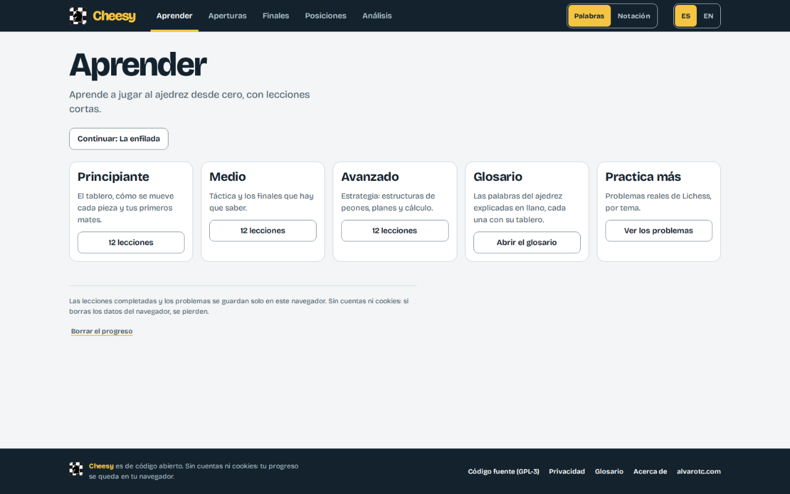
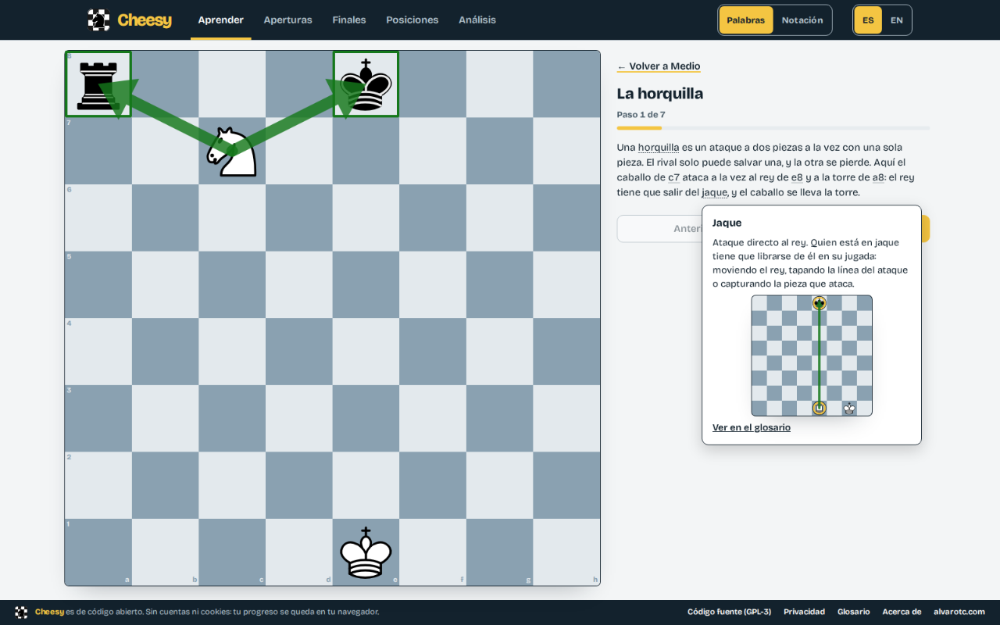
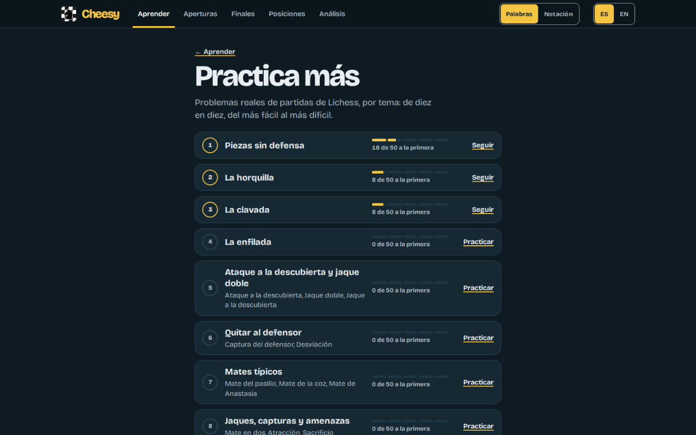
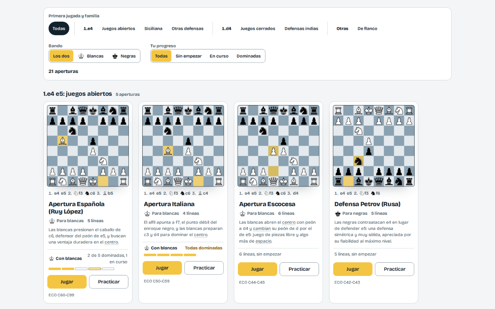
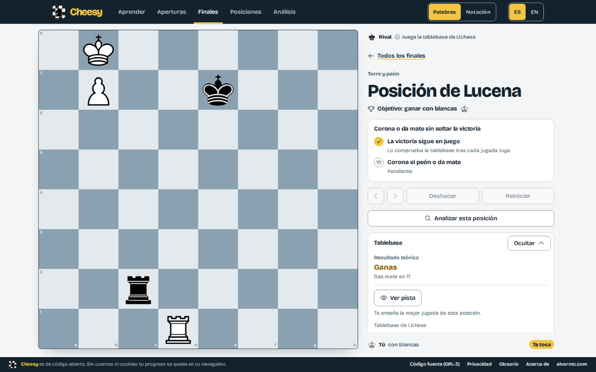
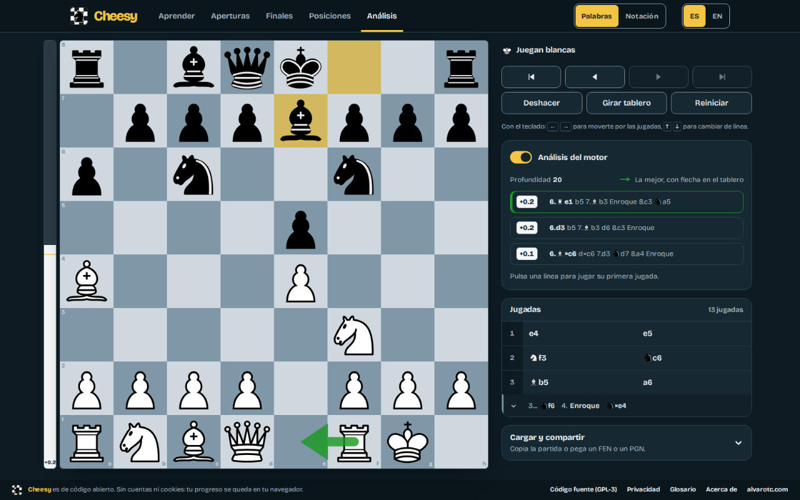

_**Español** · [English](README.en.md)_

# Cheesy

**Aperturas, finales y táctica, en tu navegador.** Aprende a jugar desde cero
con lecciones cortas, juega aperturas y finales contra el ordenador, encuentra la
jugada en posiciones tácticas y analiza con motor. Todo en lenguaje llano: las
jugadas se leen en palabras («caballo a f3») y, si lo prefieres, en notación.
Es para quien quiere aprender y practicar ajedrez a su ritmo: no hay cuenta que
crear, ni nada que instalar, ni anuncios, y tu progreso se queda en tu equipo.

[](https://cheesy.alvarotc.com)


[](https://github.com/alvarotorresc/cheesy/actions/workflows/ci.yml)


## Qué puedes hacer

- **Aprender ajedrez desde cero, por niveles.** Principiante, medio y avanzado:
  desde cómo se mueve cada pieza hasta la táctica, los finales que hay que saber
  y la estrategia. Cada lección avanza por pasos con un tablero y texto en
  lenguaje llano, y mezcla explicaciones con ejercicios: encontrar la jugada,
  elegir entre opciones o jugar la posición hasta el final. Las palabras de
  ajedrez se abren en una burbuja con su definición, y el glosario las reúne
  todas por familias, cada una con su tablero de ejemplo. Se recuerdan las
  lecciones que completas, y la página te lleva a la siguiente. Hay 36
  lecciones (12 por nivel), 89 términos en el glosario y 550 problemas.

  

  

- **Practicar más con problemas reales de Lichess.** Cada lección de táctica y
  de finales tiene sus problemas, sacados de la
  [base abierta de problemas de Lichess](https://database.lichess.org) (CC0), de
  diez en diez y del más fácil al más difícil. Se recuerda cuántos resuelves a la
  primera.

  

- **Aprender aperturas jugándolas y practicándolas.** En Jugar, el rival
  responde con las líneas que cubrimos, más a menudo la principal, o es
  Stockfish en cinco niveles de fuerza; la teoría va al lado y te avisa cuando
  te sales de ella. En Practicar solo vale la jugada de la línea: queda dominada
  tras tres pasadas seguidas sin fallos.

  

  

- **Convertir y aguantar finales contra un rival perfecto.** El rival juega
  con la tablebase de Lichess, y un panel te dice el veredicto de la posición.
  En los finales de tablas hay que aguantar quince jugadas sin perderlas. Los que
  superas se recuerdan.

  

- **Buscar la mejor jugada en posiciones tácticas.** Cada posición tiene su
  número, de menos a más jugadas, y no te enseña la solución antes de resolverla.
  Se recuerdan las que resuelves, y las que aciertas a la primera.
- **Analizar cualquier idea en un tablero libre.** El historial es un árbol
  donde puedes añadir variaciones y plegarlas; el motor es opcional (barra de
  evaluación y tres mejores líneas); importas y exportas FEN y PGN; y los enlaces
  llevan una posición, sus jugadas o el árbol entero con sus variaciones.

  

- **Leer las jugadas como prefieras y jugar con el teclado.** Un conmutador en
  la cabecera cambia entre palabras y notación en toda la app. El tablero se
  maneja sin ratón: las flechas mueven un cursor por las casillas e Intro elige
  la pieza y la juega.

## Privacidad

No hay servidor propio, ni cuenta, ni cookies. Tu progreso se guarda en tu
navegador (IndexedDB), y la página Acerca de lo explica dentro de la app, con
cómo borrarlo.

Solo salen dos cosas del navegador:

- **En Finales**, la posición se consulta en la
  [tablebase de Lichess](https://tablebase.lichess.ovh), sin cookies ni
  referrer.
- **En producción**, las visitas se cuentan con un [Umami](https://umami.is)
  autoalojado, sin cookies ni datos personales y respetando Do Not Track. No se
  carga en `localhost`.

## Desarrollo

Angular 22 con componentes standalone, señales y detección de cambios sin zone.js.
Alojado como sitio estático en Netlify.

- [Angular](https://angular.dev) 22
- [chessground](https://github.com/lichess-org/chessground) para el tablero
- [chessops](https://github.com/niklasf/chessops) para las reglas, SAN, FEN y PGN
- [Vitest](https://vitest.dev) para los tests unitarios
- ESLint, Prettier y Lefthook para la calidad del código

### Requisitos

pnpm 10 o superior, ejecutándose sobre Node.js 22 o superior. No hace falta
instalar nada más:

- pnpm cambia solo a la versión fijada en `packageManager` (11.28.0).
- Node.js 26.10.0 está fijado en `devEngines.runtime`. `pnpm install` lo descarga
  y todos los scripts de `pnpm` se ejecutan con él, sea cual sea el Node.js
  instalado en la máquina.

```bash
pnpm install
pnpm dev
```

Después abre `http://localhost:4200`.

### Scripts

| Script                   | Qué hace                                                                              |
| ------------------------ | ------------------------------------------------------------------------------------- |
| `pnpm dev`               | Arranca el servidor de desarrollo (`pnpm start` es lo mismo)                          |
| `pnpm build`             | Genera el bundle de producción en `dist/cheesy/browser`                               |
| `pnpm test`              | Ejecuta una vez los tests unitarios y las comprobaciones rápidas del contenido        |
| `pnpm test:coverage`     | Ejecuta los tests unitarios con informe de cobertura en `coverage/`                   |
| `pnpm lint`              | Pasa el linter por TypeScript y plantillas                                            |
| `pnpm format`            | Formatea el código con Prettier                                                       |
| `pnpm format:check`      | Comprueba el formato sin escribir                                                     |
| `pnpm content:build`     | Regenera los JSON del contenido a partir de sus fuentes                               |
| `pnpm content:test`      | Ejecuta las comprobaciones rápidas del contenido: esquema y jugadas legales           |
| `pnpm content:typecheck` | Comprueba los tipos de las herramientas del contenido                                 |
| `pnpm content:verify`    | Contrasta el contenido con Stockfish y la tablebase de Lichess (lento, no está en CI) |

Un hook de pre-commit, que se instala con `pnpm install`, pasa el linter y el
formateo por los archivos preparados.

### Rutas

| Ruta                     | Qué es                                                                     |
| ------------------------ | -------------------------------------------------------------------------- |
| `/`                      | Portada: las secciones con una pequeña vista previa animada de cada una    |
| `/openings`              | El catálogo de aperturas, con filtros y tu progreso en cada una            |
| `/openings/:id`          | Juega una apertura contra el motor, con su teoría al lado                  |
| `/openings/:id/practice` | Practica las líneas de esa apertura y encadena una racha en cada una       |
| `/endgames`              | Los finales que ganar o aguantar, con los superados marcados               |
| `/endgames/:id`          | Juega un final contra un rival perfecto                                    |
| `/positions`             | La galería de posiciones tácticas, con filtros y las que has resuelto      |
| `/positions/:id`         | Encuentra la mejor jugada en una posición                                  |
| `/analysis`              | Un tablero libre para explorar cualquier idea                              |
| `/learn`                 | Aprender: los niveles, el glosario, «Practica más» y tu siguiente lección  |
| `/learn/:level`          | Las lecciones de un nivel, con las completadas marcadas                    |
| `/learn/:level/:lesson`  | Una lección, paso a paso                                                   |
| `/learn/glossary`        | El glosario, con buscador y filtros por nivel y familia                    |
| `/learn/puzzles`         | «Practica más»: los problemas de Lichess de cada lección                   |
| `/learn/puzzles/:lesson` | Una tanda de diez problemas de esa lección                                 |
| `/acerca`                | Acerca de: qué se guarda, qué sale del navegador, créditos y código fuente |

Detalles que no se ven en la tabla:

- La dirección antigua `/openings/:id/drill` redirige a la práctica, y
  `/glossary` lleva al glosario dentro de Aprender.
- Los filtros del glosario van en la dirección (`?group=tactics&level=advanced&q=…`).
- En Finales, el rival recurre a Stockfish cuando la tablebase no responde.
- Cada posición lleva un número en su dirección (`/positions/1`), de menos a más
  jugadas.
- En Análisis, los enlaces llevan una posición (`/analysis?fen=…`), sus jugadas o
  el árbol entero con sus variaciones (`&pgn=…`). Las otras secciones abren aquí
  con un enlace para volver de donde vienes.
- El motor de Análisis está apagado por defecto: descarga unos 2 MB la primera
  vez que se enciende.
- `/acerca` es la ruta en español en los dos idiomas.

### Estructura

```
src/app/
  core/       estado de la partida (chessops), árbol de jugadas y enlaces de análisis,
              progreso (IndexedDB), traducciones y carga del contenido
  layout/     lo que rodea a cada página: el pie y el relleno de cada tipo de ruta
  shared/     componentes de presentación: tablero, minitablero, lista de jugadas,
              iconos, aviso
  features/   una carpeta por sección, cargadas de forma diferida
content/      fuentes y comprobaciones de las aperturas, los finales, las posiciones,
              las lecciones, el glosario y los problemas
```

El contenido es fijo y se valida antes de llegar a la app: mira
[content/README.md](content/README.md).

### Capturas

```bash
pnpm media                                              # capturas, textos, promos e icono en media/out/
pnpm media:shots --only screen-02 --lang es --no-build  # repite una sola captura
pnpm media:readme                                       # regenera .github/readme/
```

La primera vez hace falta `pnpm exec playwright install chromium`. Cómo se hacen
las capturas está en [media/README.md](media/README.md).

## Autor

Hecha por [Alvaro Torres](https://github.com/alvarotorresc). Licencia
[GPL-3.0](LICENSE).

## Créditos

- [chessground](https://github.com/lichess-org/chessground), el tablero que usa Lichess, con licencia GPL-3.0-or-later.
- [chessops](https://github.com/niklasf/chessops), reglas y notación del ajedrez, con licencia GPL-3.0-or-later.
- [Stockfish](https://stockfishchess.org), el motor de ajedrez, con licencia GPL-3.0, que se ejecuta en el navegador desde el paquete [stockfish](https://www.npmjs.com/package/stockfish) (versión lite, de un solo hilo).
- [Lichess](https://lichess.org), cuyo trabajo de código abierto hace posible este proyecto. El juego de piezas es el de cburnett, tal como viene con chessground.
- [lichess-org/chess-openings](https://github.com/lichess-org/chess-openings), nombres y códigos ECO de las aperturas, usados para comprobar el contenido, dedicados al dominio público con CC0.
- La [base abierta de problemas de Lichess](https://database.lichess.org), dedicada al dominio público con CC0, de la que salen los problemas de «Practica más».
- La [tablebase de Lichess](https://tablebase.lichess.ovh) y [Stockfish](https://stockfishchess.org), usados para verificar los finales y las posiciones.
